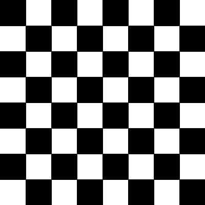
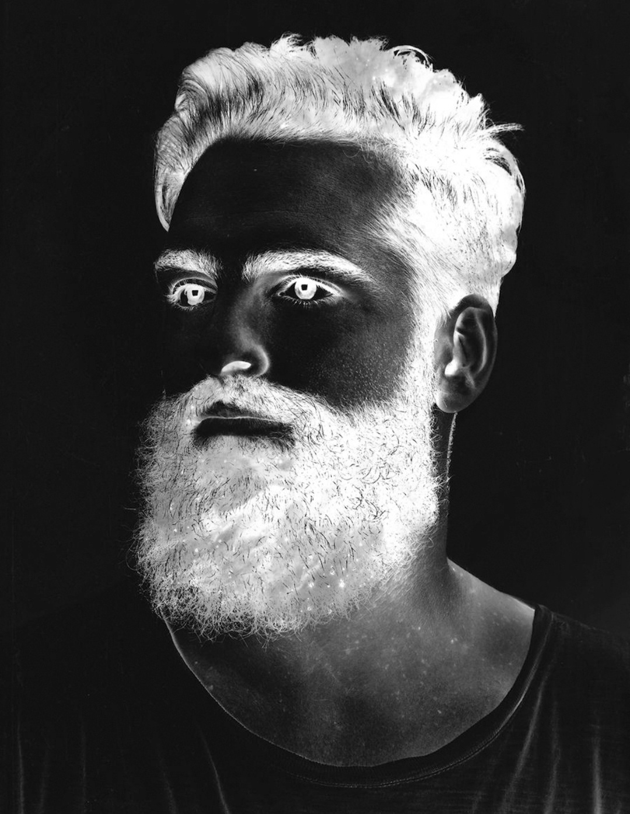
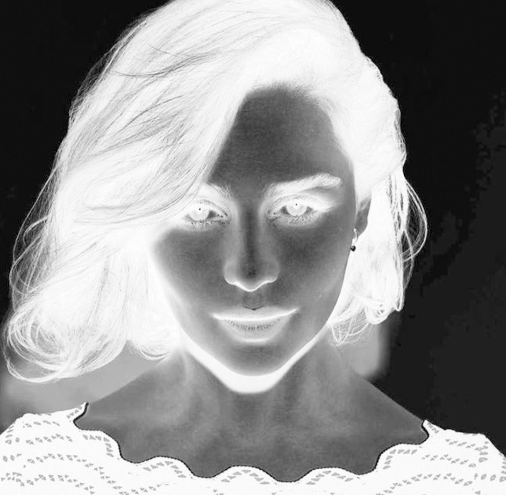
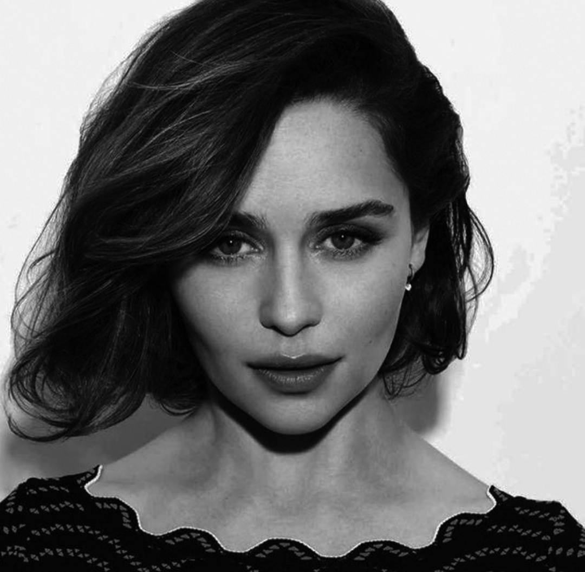
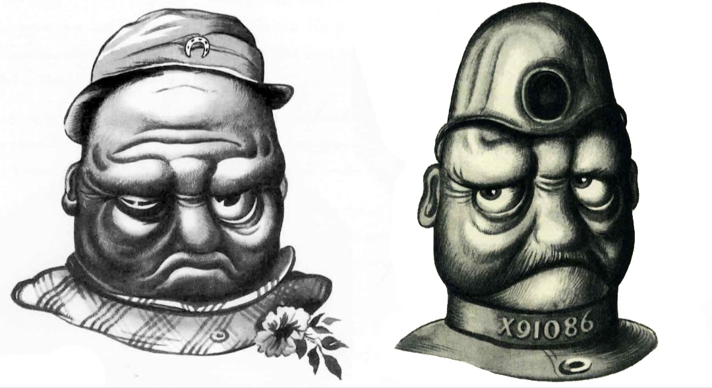
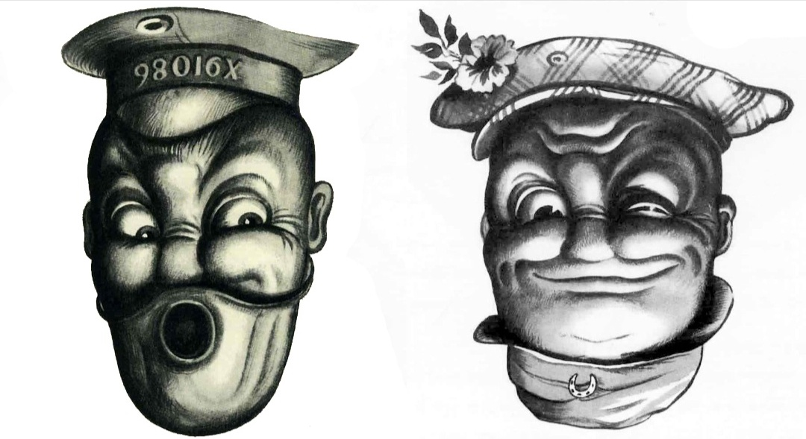
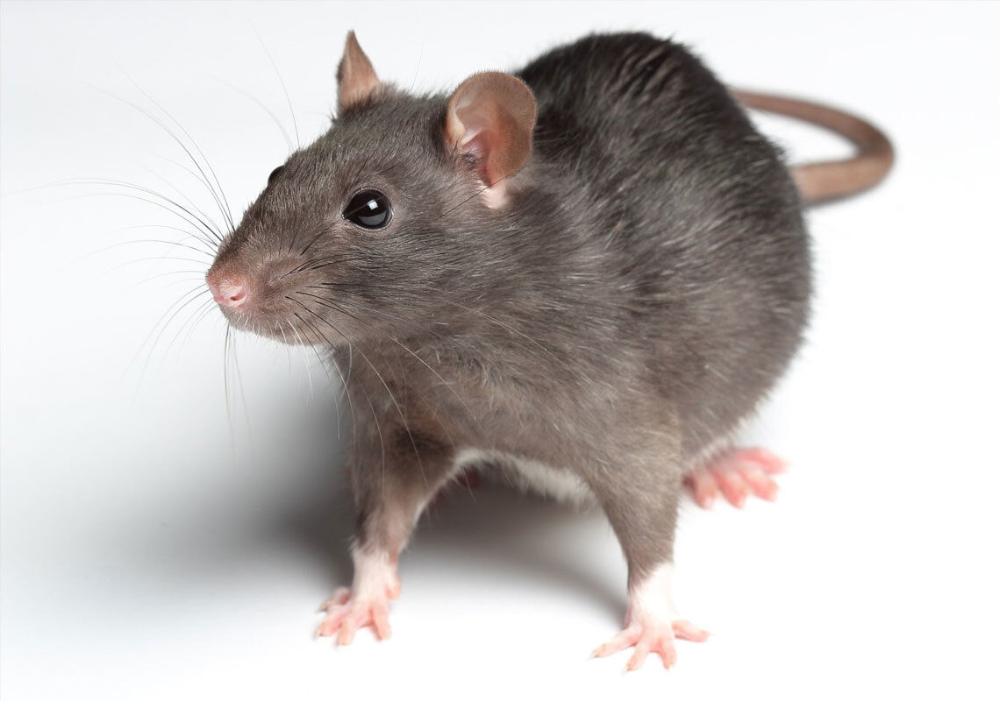
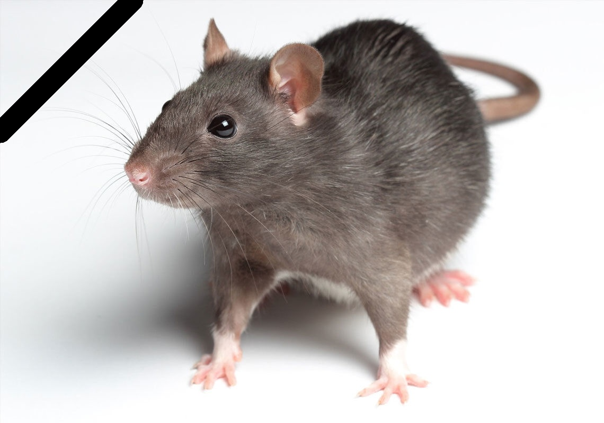

# Assignment 26

## Image-Processing _ 1

### What's there :

- There are six folder in this assignment with names of :
  - *Chessboard* , *Character* , *Gradient* , *Invert* , *Rotate* , *Death*
    - Chessboard : Change all-white image to chessboard
    - Character : Write letter **J** in white image
    - Gradient : Generate a gradient (shade)
    - Invert : Invert light and dark colors 
    - Rotate : Rotate an image
    - Death : Add black ribbon
  - All these practices were implemented using the *OpenCV* library

## Outputs :

### Chessboard :

This :  
To: 


### Character :

 


### Gradient :

 


### Invert :

This :
To :

And this :
To :


### Rotate :

These sad mans :
To happy mans :


### Death :

Mr. Mouse :
The deceased Mouse :


### Installation guide for python files
To execute this program you need to install a library

**OpenCV**  

You can install them by using the *pip* command :

For instance :
**pip install OpenCV**

But for importing this library you need this command :
```
import cv2
```

## How To Run

To run python files , open your *cmd* or *Terminal* and enter this command :
```
python file-name.py
```
