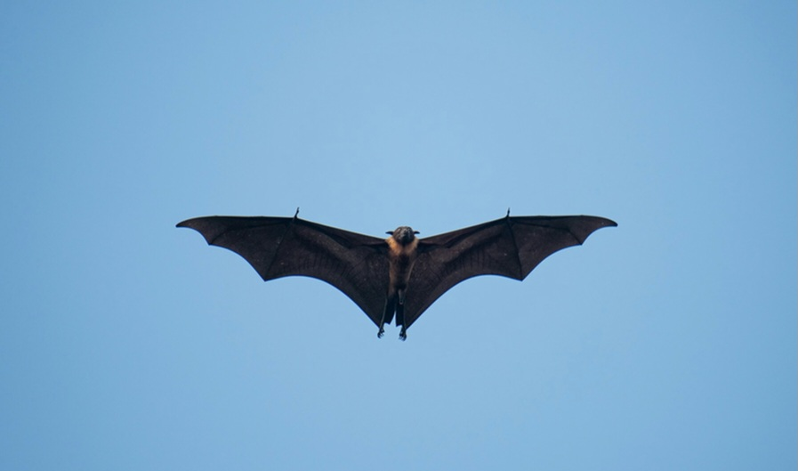
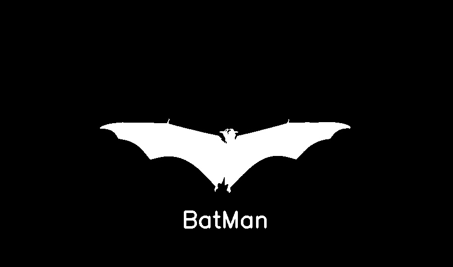

# Assignment 27

## Image-Processing _ 2

### What's there :

- There are four folder in this assignment with names of :
  - *Batman* , *Noise* , *color detector* , *landscape*
    - color detector : Using webcam to detect *white* , *gray* , *black*  colors
    - landscape : Make changes on an image to create landscape with snowfall
    - Batman : Threshold the bat image and make the Batman logo
    - Noise : Create a TV noise , save output as gif
  - All these practices were implemented using the *OpenCV* library

## Output :

### Batman :

This :  
To: 

**Other outputs** saved as gif , for instance :
- 

### Installation guide for python files
To execute this program you need to install a library

**OpenCV**  , **numpy** , **imageio** , **random**

You can install them by using the *pip* command :

For instance :
**pip install OpenCV**

Note : for importing OpenCV library you need this command :
```
import cv2
```

## How To Run

To run python files , open your *cmd* or *Terminal* and enter this command :
```
python file-name.py
```
