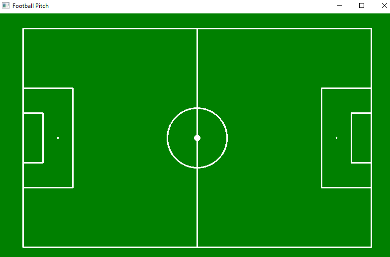
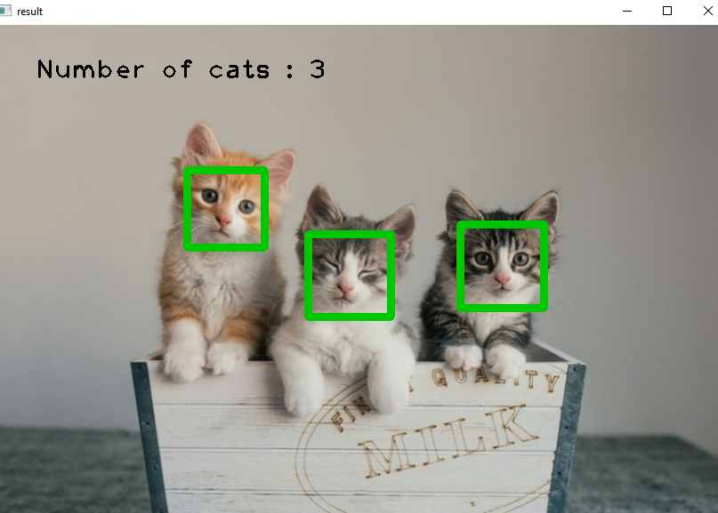

# Assignment 28

## Image-Processing _ 3

### What's there :

- There are three folder in this assignment with names of :
  - *cat_face-detection* , *football_pitch* , *face_filters*
    - cat_face-detection : detect cat faces and display their count
    - football_pitch : draw a football pitch
    - face_filters : overlay filters on the detected face 
      - Press **1** : Apply animal_face filter
      - Press **2** : Apply glasses&lips filter
      - Press **3** : Apply chassed_face filter
      - Press **4** : Apply mirror filter
  - All these practices were implemented using the *OpenCV* library

## Outputs :

### Football_pitch :

output : 

### Cat-face_detection :

Input :  

 Output : 

### Face_filter :

1 : 

### Installation guide for python files
To execute this program you need to install a library

**OpenCV**  , **numpy**

You can install them by using the *pip* command :

For instance :
**pip install OpenCV**

Note : for importing OpenCV library you need this command :
```
import cv2
```

## How To Run

To run python files , open your *cmd* or *Terminal* and enter this command :
```
python ( cat_face.py / football.py / filter.py )
```
