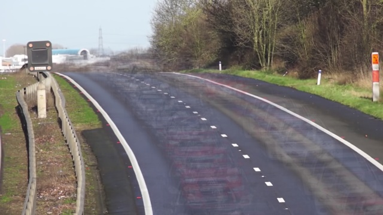
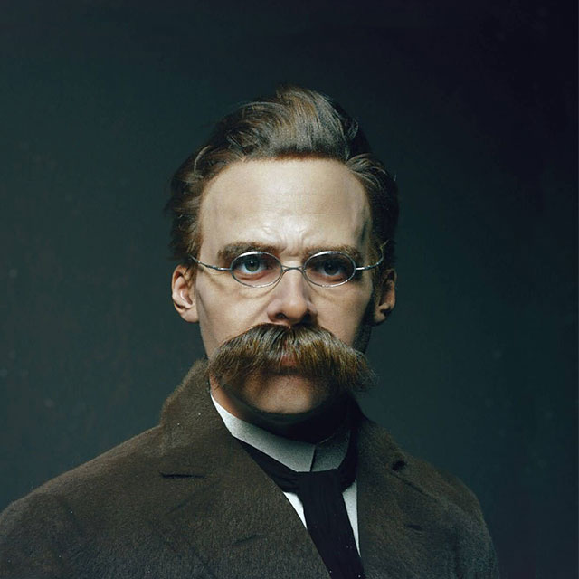
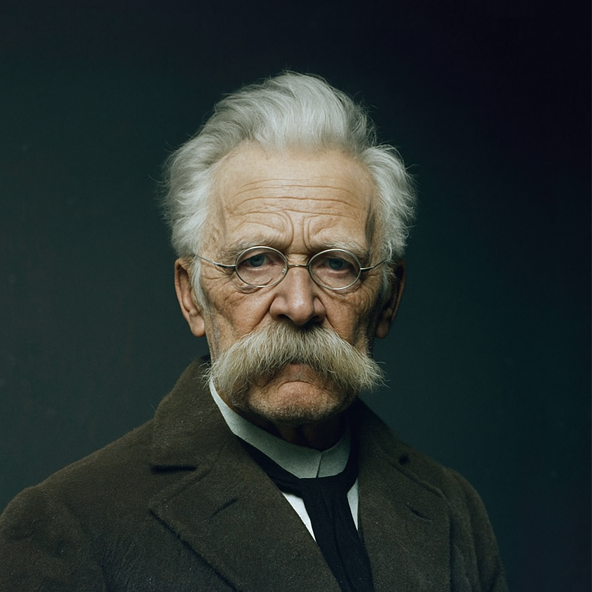
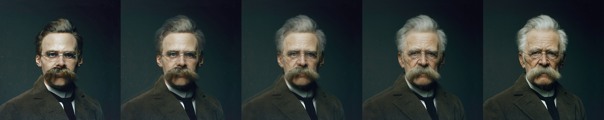
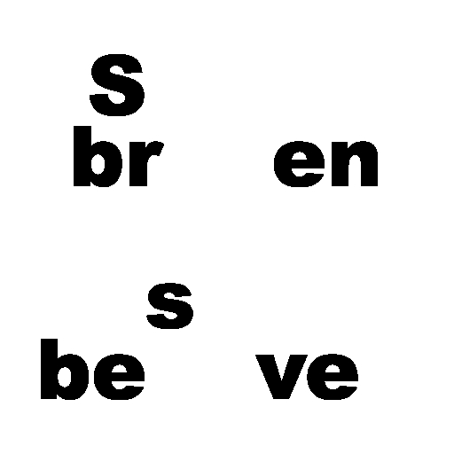
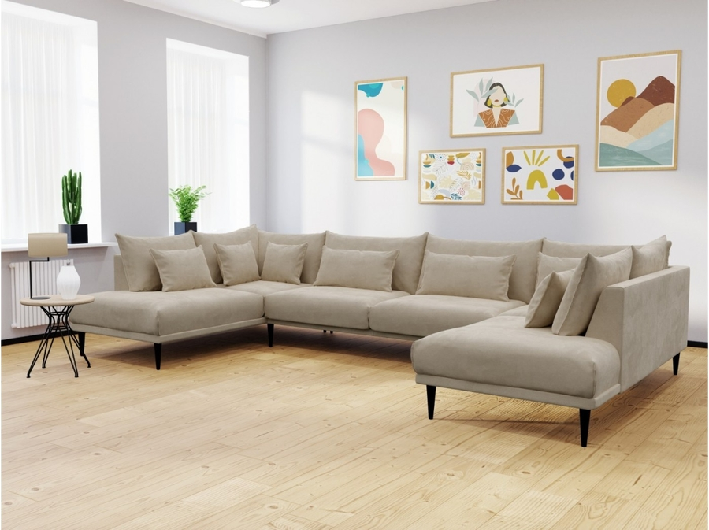
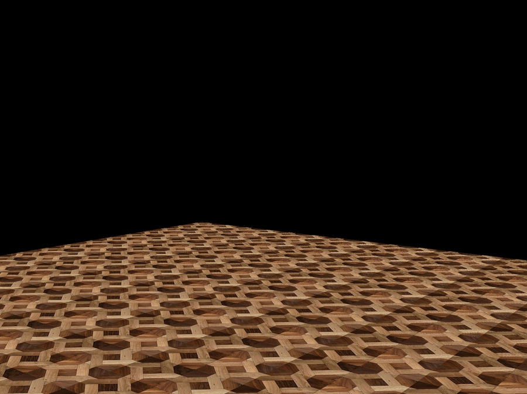
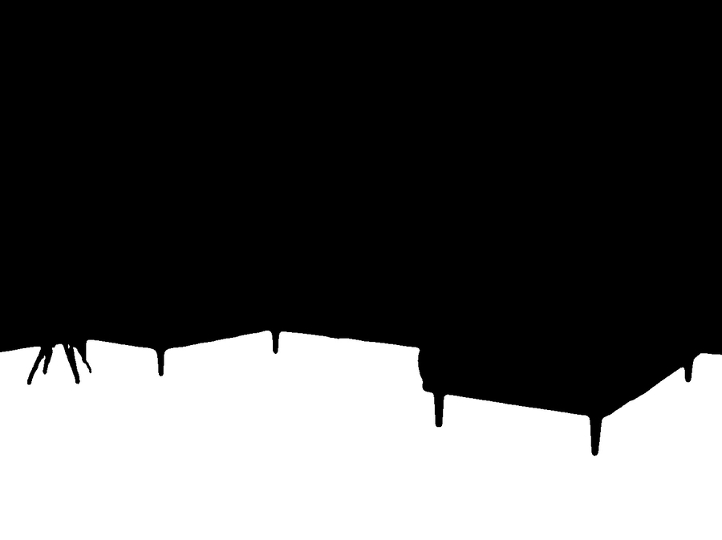
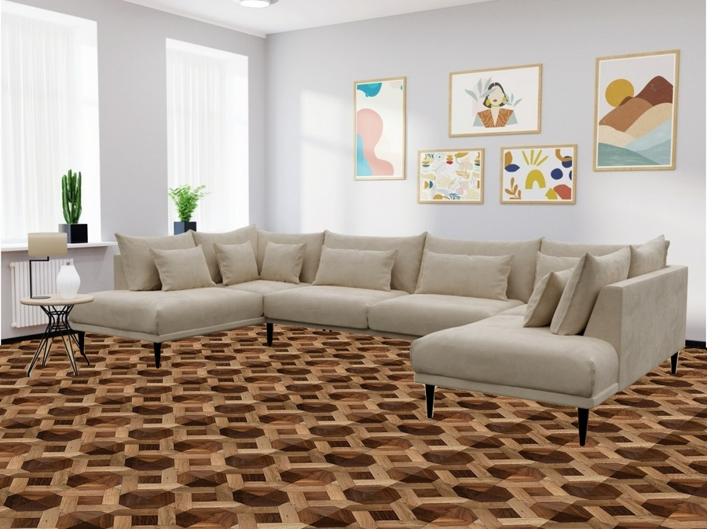

# Assignment 29

## Image-Processing _ 4

### What's there :

- There are six folder in this assignment with names of :
  - *black_hole* , *cars_background* , *change_decoration* , *face_morphing* , *photo_to_sketch* , *sabtract_images*
    - change_decoration : This file apply changes on floor of input image by masking images
    - cars_background : To get a **.mp4** file as input and give background of that video file
    - photo_to_sketch : You can give your photo as input and this file change it to sketch
    - sabtract_images : With subtraction ability you can make new images
    - face_morphing : Morph images and concatenate them
    - black_hole : Resolve noises of images
      - read images from a folder , remove the noise of images and generate a cleaner image
      - here some guidance :
        -  **hole_result1.jpg** is output of the folder with name of **1**
        -  **hole_result2.jpg** is output of the folder with name of **2**
        -  **hole_result3.jpg** is output of the folder with name of **3**
        -  **hole_result4.jpg** is output of the folder with name of **4**
      - After generate cleaner version of each part , concatenate them and make a *black hole* image without noise
  - All these practices were implemented using the *OpenCV* library

## Outputs :

### Black_hole :

Output : 

### Cars_background :

Output : 

### Photo_to_sketch :

Input :  

 Output : 

### Face_motphing :

Input_1 : 
Input_2 : 

 Output : 

 ### Subtract_images :

Input_1 : 
Input_2 : 

 Output : 

### Change_decoration :

Input_1 : 
Input_2 : 
Input_3 : 

 Output : 

### Installation guide for python files
To execute this program you need to install a library

**OpenCV**  , **numpy**

You can install them by using the *pip* command :

For instance :
**pip install OpenCV**

Note : for importing OpenCV library you need this command :
```
import cv2
```

## How To Run

To run python files , open your *cmd* or *Terminal* and enter this command :
```
python ( cat_face.py / football.py / filter.py )
```
