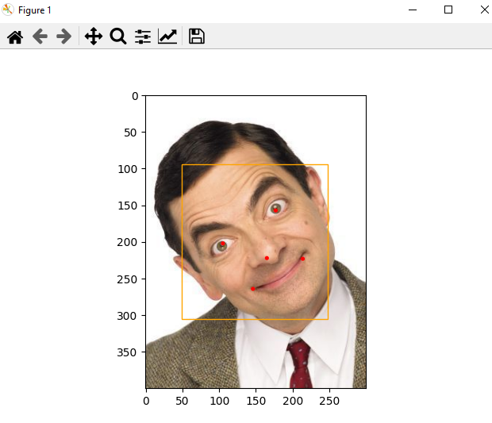

# Assignment 30

## Image-Processing _ 5

### What's there :

- There are 4 folder in this assignment with names of :
  - *Align_images* , *Big_lips&eyes_filter* , *Fruit_face_filter* , *Rotate_images*
    - Big_lips&eyes_filter : Apply **big_eyes&lips** filter on images and rematch them on face
    - Fruit_face_filter : It could extract eyes&lips from an image and add them to the fruits
    - Rotate_images : You can rotate your image with **main.py** file in this folder
    - Align_images : This source code align face based on left eye and right eye
  - All these practices were implemented using the *OpenCV* library

## Outputs :

### Big_lips&eyes_filter :

Output : 

### Fruit_face_filter :

Output : 

### Rotate_images  :

Input :  

 Output : 

### Align_images :

Input : 

 Output_1 : 
Output_2 : 
Output_3 : 


### Installation guide for python files
To execute this program you need to install a library

**OpenCV**  , **numpy**

You can install them by using the *pip* command :

For instance :
**pip install OpenCV**

Note : for importing OpenCV library you need this command :
```
import cv2
```

## How To Run

To run python files , open your *cmd* or *Terminal* and enter this command :
```
python main.py
```
