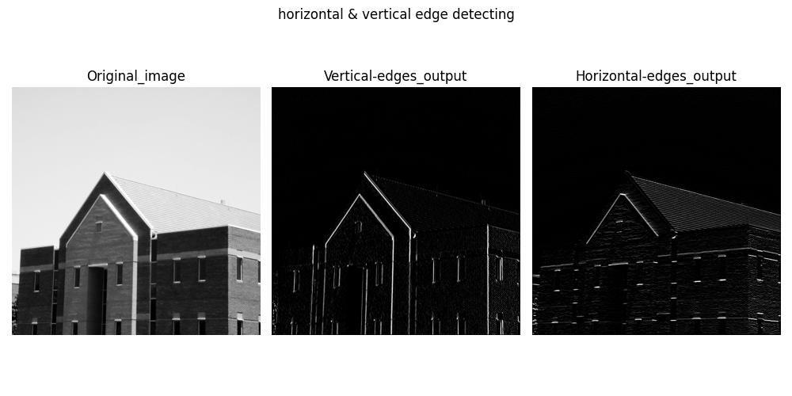
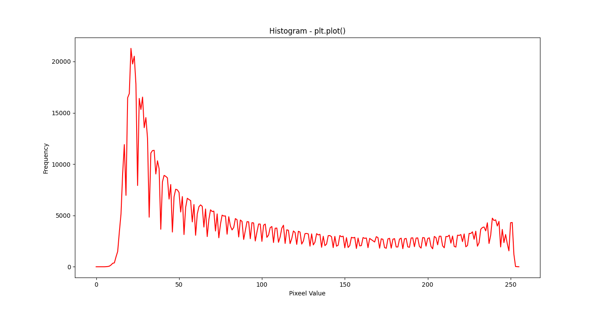
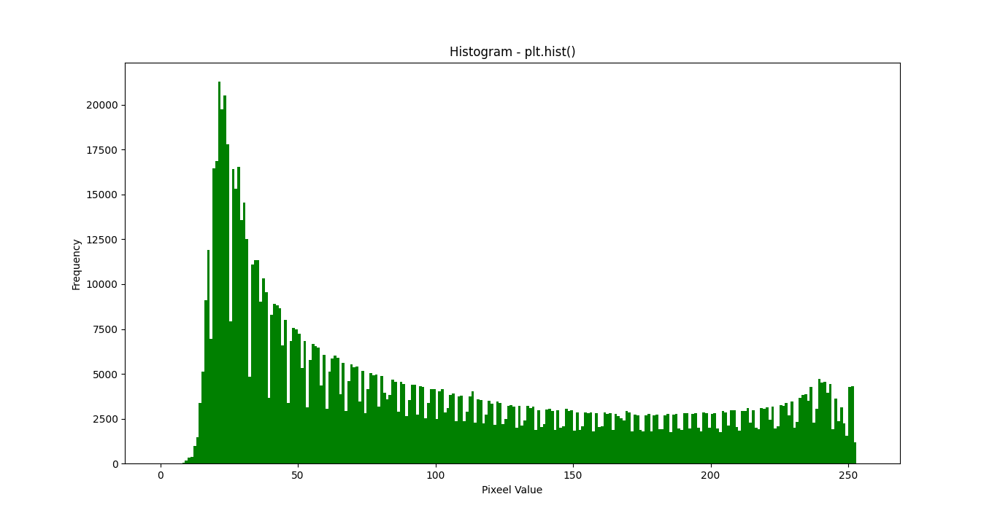
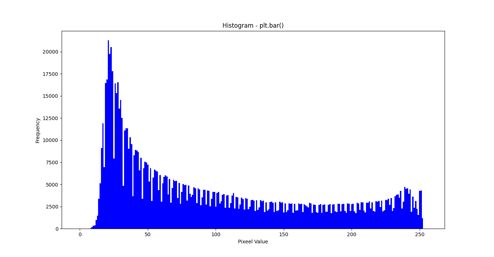
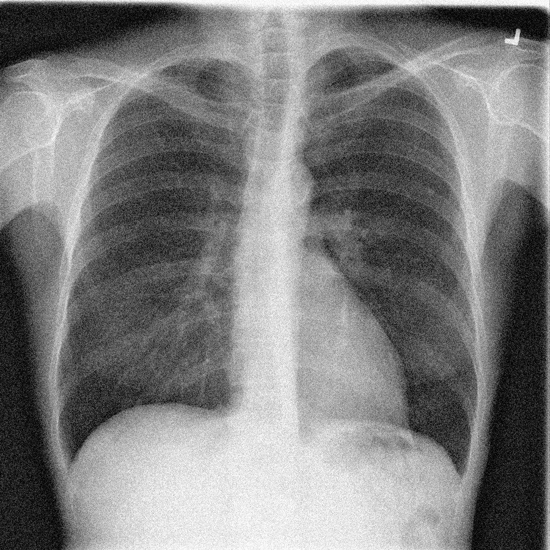
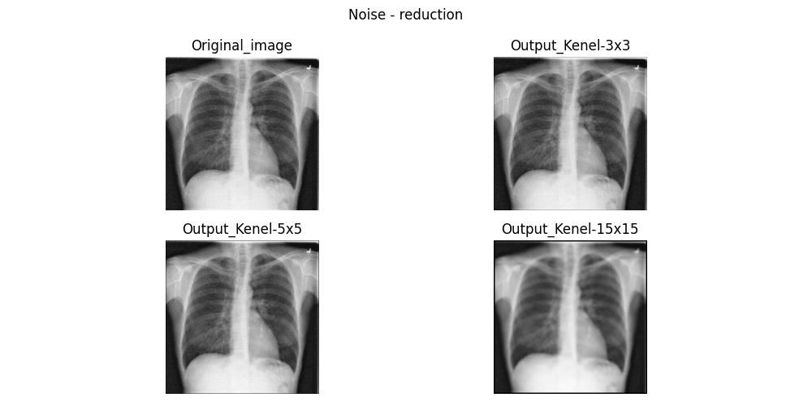
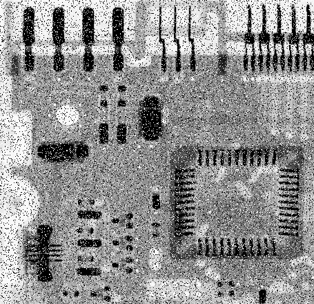
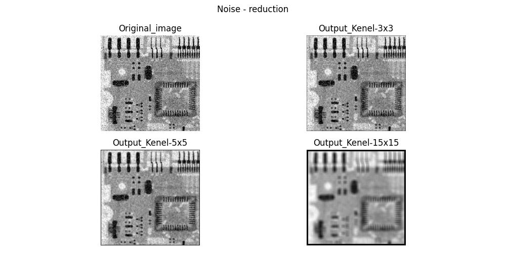
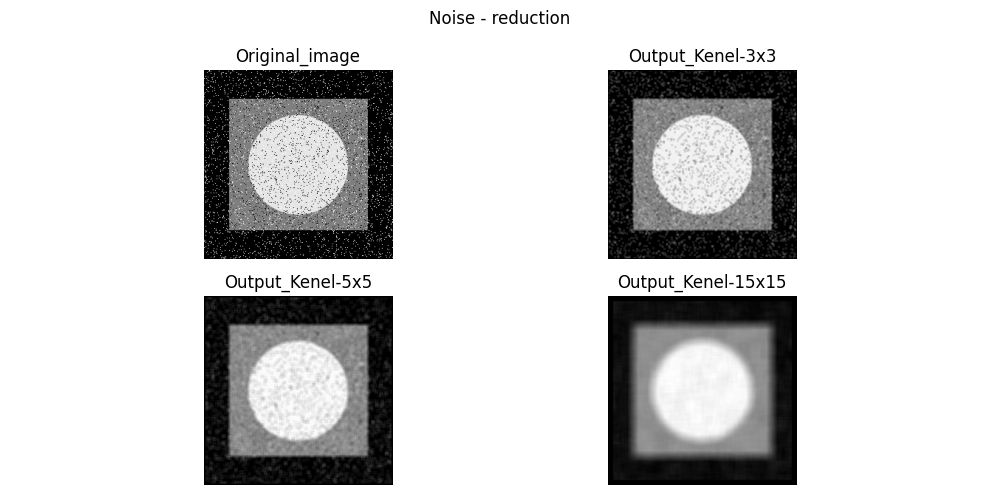

# Assignment 31

## Image-Processing _ 6

### What's there : 

- There are five folder in this assignment with names of :
  - *Horizontal&Vertical_edge_detection* , *Noise_reduction* , *Edge_detection* , *Histogram* , *Blurred*
    - Horizontal&Vertical_edge_detection : Detecting , horizontal and vertical edges from image
    - Noise_reduction : Get an image as input and reducing noises with three different kernels
    - Histogram : calculate and draw histogram for (0-255) , dark to light color of an image
    - Blurred : This file get an image as input and blurred the background
    - Edge_detection : It can detect the edges from an image 
  - All these practices were implemented using the *OpenCV* library

## Outputs :

### Herizontal&Vertical_edge_detection :

Input :  

 Output : 

### Blurred : 

Input :  

 Output : 
 
### Histogram :

 Output_plt.plot() : 
 
 Output_plt.hist() : 
 
 Output_plt.bar() : 

### Edge_detection :

Input :  

 Output : 

Input :  

 Output : 

### Noise_reduction :

Input :  

 Output : 

Input :  

 Output : 
 
Input :  

 Output : 


### Installation guide for python files
To execute this program you need to install a library

**OpenCV**  , **numpy** , **matplotlib**

You can install them by using the *pip* command :

For instance :
**pip install OpenCV**

Note : for importing OpenCV library you need this command :
```
import cv2
```

## How To Run

To run python files , open your *cmd* or *Terminal* and enter this command :
```
python "file_name".py
```
