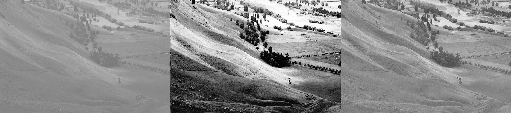
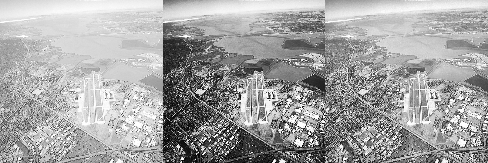
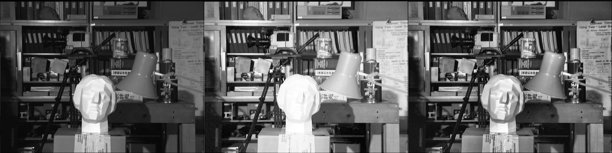
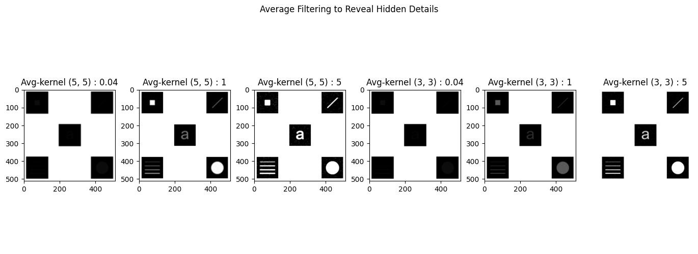
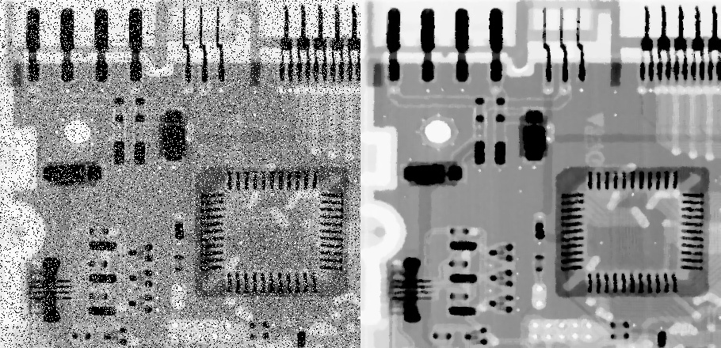
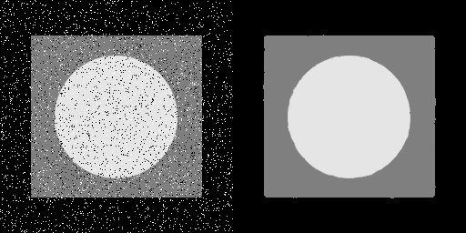
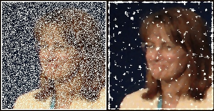
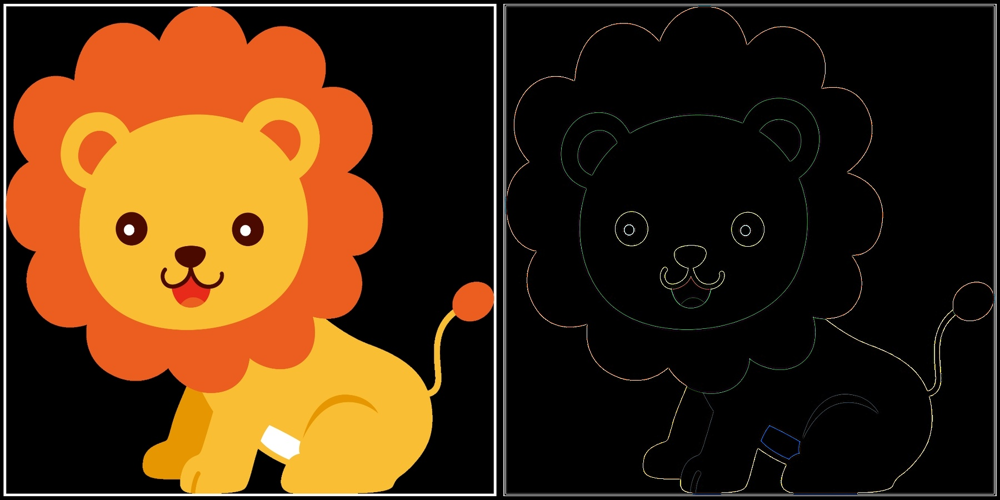
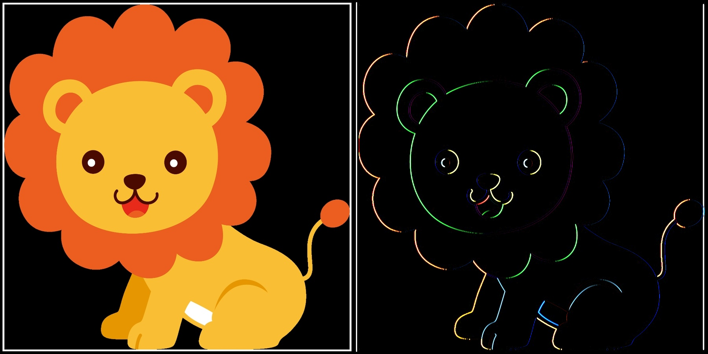

# Assignment 32

## Image-Processing _ 7

### What's there : 

- There are four folder in this assignment with names of :
  - *Histogram_Equalization* , *Average_filter* , *Median_filter* , *Convolution* :
    - Histogram_Equalization : Equalize histogram by , **cv2.equalizeHist & cv2.createCLAHE**
    - Average_filter : Reveal hidden things from an image by , **average-filter**
    - Median_filter : Reduce noise from each image by , **median-filter**
    - Convolution : Apply five 2D filters with different kernels
      - Edge-detection_filter
      - Sharpening_filter
      - Emboss_filter
      - Identity_filter
      - My-filter
  - All these practices were implemented using the *OpenCV* library

## Outputs :

### Histogram_Equalization :

For all these outputs :
  - first image is input
  - second one is output of cv2.equalizeHist
  - Third image is output of cv2.createCLAHE

 #### Outputs : 
 
 
 

### Average_filter : 

Input :  

 Output : 
 
### Median_filter :

For all these outputs :
  - first image is input
  - second one is output of median-filter

 #### Outputs :
 
 
 
 
 

### Convolution :

For all these outputs :
  - first image is input
  - second one is output of five different kernels

 #### Output :

 ##### Edge-detecting_filter
 
 ##### Identity_filter
 
 ##### Emboss_filter
 
 ##### My_filter
 
 ##### Sharping_filter
 

### Installation guide for python files
To execute this program you need to install a library

**OpenCV**  , **numpy** , **matplotlib**

You can install them by using the *pip* command :

For instance :
**pip install OpenCV**

Note : for importing OpenCV library you need this command :
```
import cv2
```

## How To Run

To run python files , open your *cmd* or *Terminal* and enter this command :
```
python "file_name".py
```
